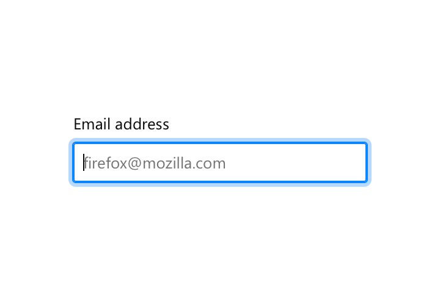
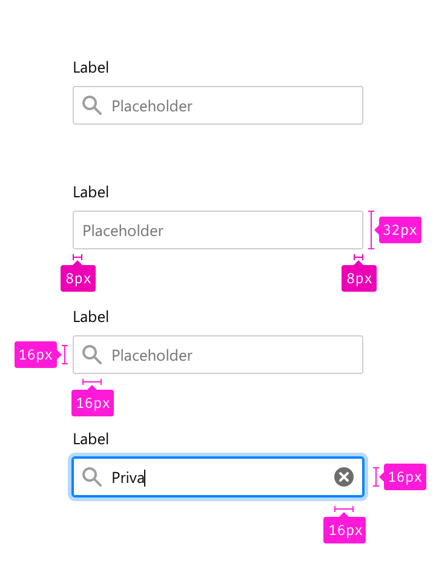
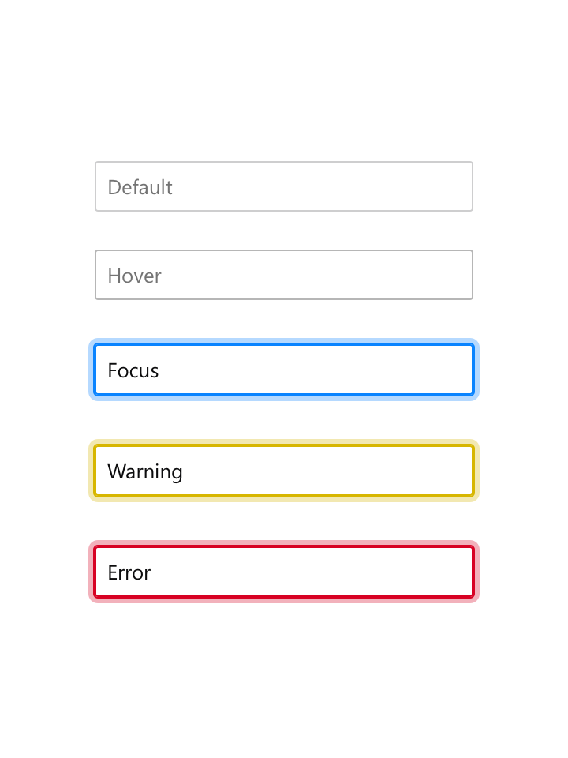
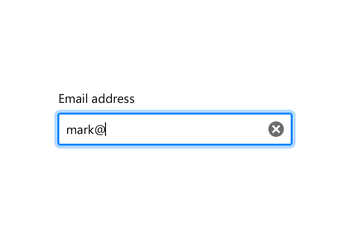
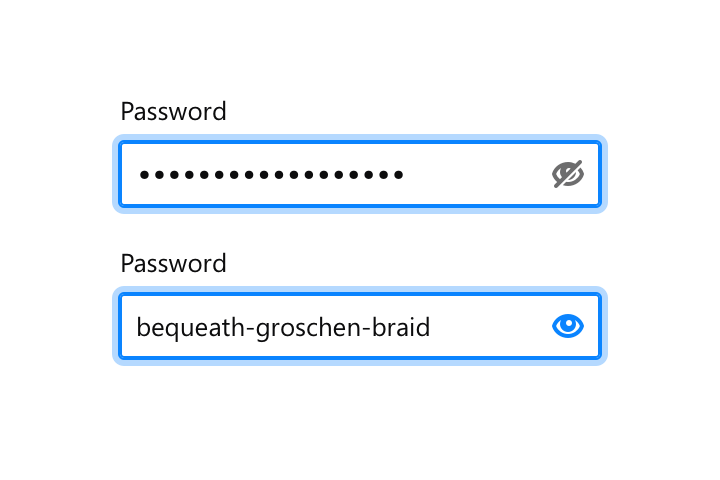

Input fields allow users to add text within a defined area.

## Usage

Use input fields when requiring users to enter text (like email address, account name, search keyword, etc.) that can’t be automatically generated or displayed.

## Styles

The following specs are designed for desktop and web.

**Size**

Label margin bottom: `8px`

Corner radius: `2px`

Padding horizontal: `8px`

Width: `auto`

Height: `32px`

**Color**

Label: Grey 90 `#0c0c0d`

Border: Grey 90 a20 `rgba(12, 12, 13, 0.2)`

Placeholder: Grey 50 `#737373`

**Typography**

Label: `0.833rem/1.4`

Placeholder: `0.833rem/1.4`

**Icons**

Icon width: `16px`

Icon height: `16px`

Placeholder icon: Grey 90 a40 `rgba(12, 12, 13, 0.4)`

Action icon: Grey 90 a60 `rgba(12, 12, 13, 0.6)`

## Behaviors

**Default**

Border color: Grey 90 a20 `rgba(12, 12, 13, 0.2)`

**Hover**

Border color: Grey 90 a30 `rgba(12, 12, 13, 0.3)`

**Focus**

Border color: Blue 50 `#0a84ff`

Box shadow: `0 0 0 1px #0a84ff, 0 0 0 4px rgba(10, 132, 255, 0.3)`

**Warning**

Border color: Yellow 60 `#d7b600`

Box shadow: `0 0 0 1px #d7b600, 0 0 0 4px rgba(215, 182, 0, 0.3)`

**Error**

Border color: Red 60 `#d70022`

Box shadow: `0 0 0 1px #d70022, 0 0 0 4px rgba(251, 0, 34, 0.3)`

In text fields, when a user starts typing display a [clear text field icon](https://design.firefox.com/icons/viewer/#clear%20text%20field%2016) on the opposite side of the field.
      

In input fields, when the text overflows outside the field add a linear gradient to indicate to users that something is hidden.
      

In password fields, when a user starts typing display a password show icon and password hide icon on press.

## Copy Rules

### Input Fields Messages

* Prioritize brevity over niceties. Don't say please. Just tell people what to do. "Choose a number that is less than..."

* Be as specific as possible in the message. "Choose a date" or "Choose a time" or "Enter an address” are all better than “Enter a value.”

* Speak to users’ cognitive processes instead of their tactile ones where possible. Use words like “choose” or “select” instead of “type” or “key”. We'd rather engage users' minds than their hands, and this also speaks more universally to users accessing the Web with touchscreens, speech-recognition software, or other user input devices.

* If there are programmatic rules governing valid choices, expose these in the messages where possible. Don't just tell someone that X is the nearest valid value, tell them that they must choose values in x increments. "Choose times in 30-minute increments from 8:00 am."

### Input Fields Placeholders

* Tell users what objects are going to be searched if possible. “Search + object” is more clear than just saying “Search”.